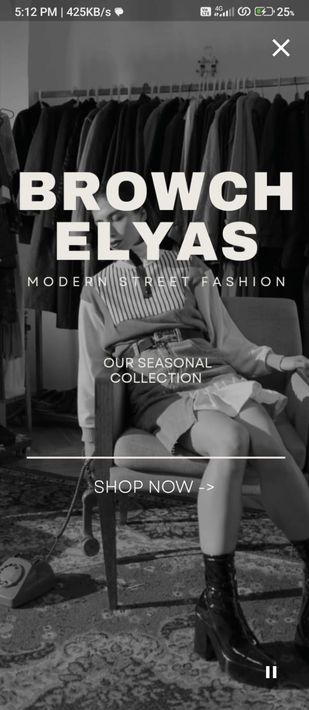
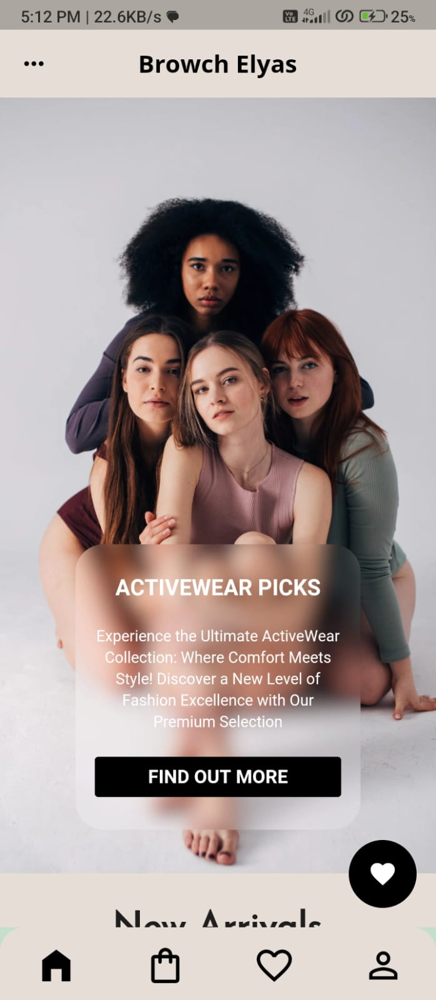
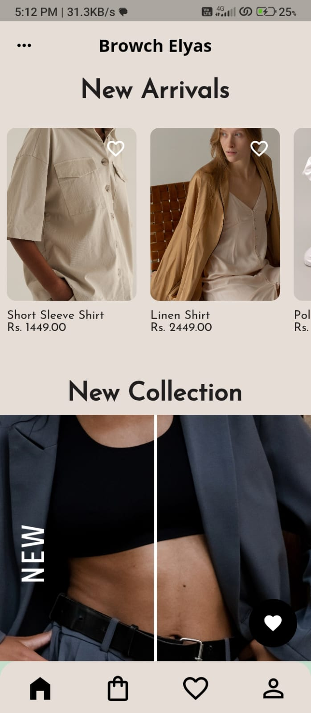
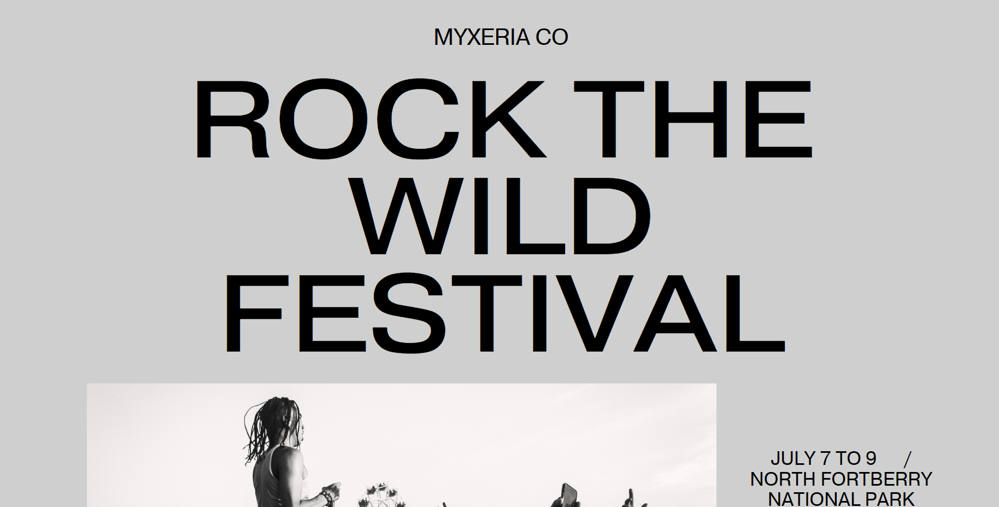
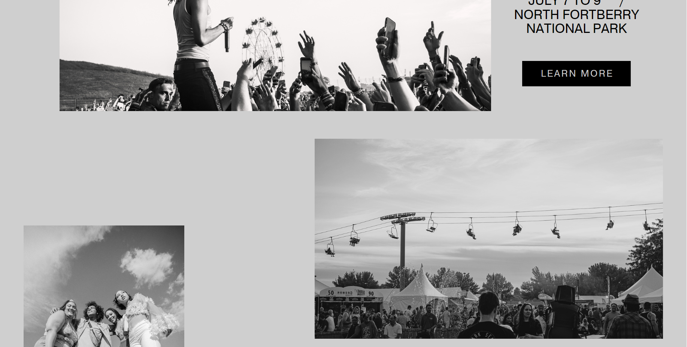
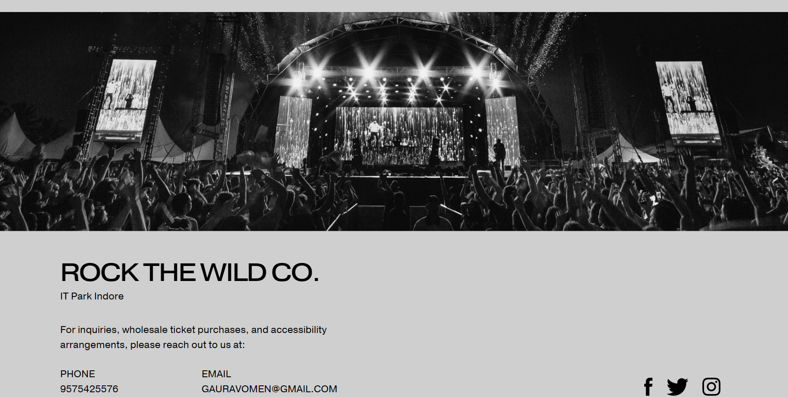
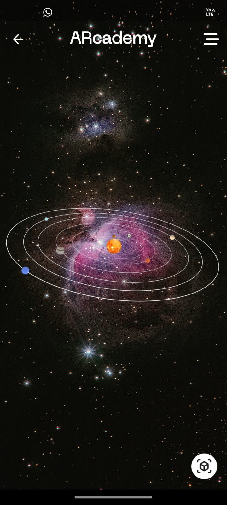
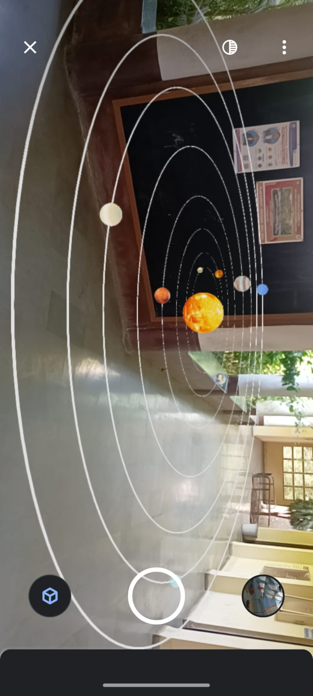
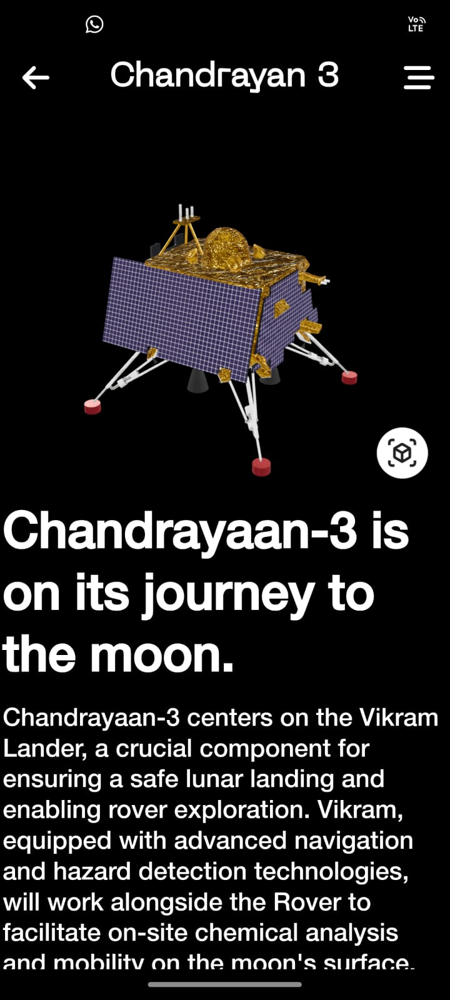
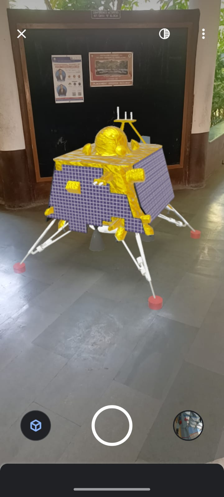

<h1 >Hi, I'm Gaurav Singh!</h1>


<p align="justify">I am Gaurav, an Android Developer committed to weaving innovative experiences using Java, Kotlin, Flutter, and the intriguing world of Augmented Reality  </p> 

###  A little more about me...  

```javascript
const gaurav = {
  code: [Java, Kotlin, XML, Dart, Flutter],
  tools: [Android Studio, Git/Github, AWS, Retrofit, Firebase, RESTful APIs],
  education: {
    degree: "B.E in Information Technology",
    institution: "Institute of Engineering and Technology DAAV, Indore",
    graduationYear: 2024,
    cgpa: 7.3
  },
  challenge: "I'm currently engaged in expanding my proficiency in Android development, focusing on Kotlin and Java."
} 
```
<h1 >Some of my work</h1>

[BROWCH ELYAS - Fashion Online Store](https://github.com/Gaurav0634/Browch_Elyas)
<div style="overflow-x: auto; white-space: nowrap;">
    
    
  
  
    <!-- Add more images in a similar fashion -->
</div>


<h3 >RockRise Reservations</h3>
<div style="overflow-x: auto; white-space: nowrap;">
    
    
  
  
    <!-- Add more images in a similar fashion -->
</div>


<h3 >The Wellhall</h3>
<div style="overflow-x: auto; white-space: nowrap;">
    
    
  
    <!-- Add more images in a similar fashion -->
</div>

[ARcademy - AR learning App](https://github.com/Gaurav0634/ARcademy)
<div style="overflow-x: auto; white-space: nowrap;">
    
    
  
  
  
    <!-- Add more images in a similar fashion -->
</div>

<br><br>
<p align="center">
    <a href="mailto:gauravomen@gmail.com">gauravomen@gmail.com</a>
</p>
